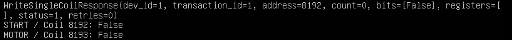

\# OpenPLC Modbus TCP Server Configuration and Validation


\## Objective


Configure OpenPLC Runtime v4 as a Modbus TCP server and validate communication between a Modbus client and PLC variables used by a Ladder Diagram program.


The test demonstrates the complete communication path:


```text

Modbus TCP Client

&#x20;       ↓

OpenPLC Modbus Server

&#x20;       ↓

PLC Memory

&#x20;       ↓

Ladder Logic

&#x20;       ↓

PLC Output

---

## Modbus TCP Server Configuration

The Modbus TCP server was configured directly from OpenPLC Editor:

```text
Device → Servers → Modbus
```

Server configuration:

```text
Protocol: Modbus/TCP
Port: 502
```

### Buffer Mapping

The Modbus Coil buffer was configured as follows:

| PLC Memory Area | Size |
|---|---:|
| `%QX` | 8192 bits |
| `%MX` | 64 bits |

The `%MX` area was required because the Boolean variables used by the PLC program are located in internal memory:

```text
START → %MX0.0
MOTOR → %MX0.1
```

After configuring the Modbus server, the PLC project was rebuilt and uploaded to OpenPLC Runtime.

---

## Modbus Address Mapping

Initial testing showed that Modbus Coil 0 did not correspond to `%MX0.0`.

The configured buffer mapping allocates the first 8192 Modbus coils to the `%QX` memory area.

The `%MX` area therefore begins at Coil 8192.

The following mapping was verified experimentally:

| PLC Variable | IEC Location | Modbus Coil |
|---|---|---:|
| START | `%MX0.0` | 8192 |
| MOTOR | `%MX0.1` | 8193 |

Therefore:

```text
Coil 8192 → %MX0.0 → START
Coil 8193 → %MX0.1 → MOTOR
```

This mapping was verified through Modbus communication and the OpenPLC online Ladder debugger.

---

## Troubleshooting: Modbus TCP/502 Not Listening

During the initial configuration, OpenPLC Runtime was reachable through its management interface on TCP/8443, but the Modbus TCP service was not listening on TCP/502.

The listening ports were checked with:

```bash
sudo ss -ltnp | grep -E ':502|:8443'
```

Initially, only TCP/8443 was available.

```text
0.0.0.0:8443    LISTEN
```

### Initial Investigation

OpenPLC Runtime v4 includes a Modbus slave plugin. The runtime plugin configuration was inspected and the `modbus_slave` plugin was initially disabled.

Manually enabling the plugin caused TCP/502 to become available.

However, after performing a new **Build & Upload** from OpenPLC Editor, the Modbus plugin was disabled again and TCP/502 disappeared.

This demonstrated that manually modifying the Runtime plugin configuration was not the correct persistent configuration method for this deployment.

### Root Cause

Further investigation showed that OpenPLC Editor generates the runtime configuration during project deployment.

When the project did not contain a configured Modbus server, the generated deployment did not include the required Modbus configuration. As a result, the runtime deployment process disabled the Modbus plugin again.

The problem was therefore not a network connectivity issue.

The issue was caused by the PLC project configuration and deployment process.

### Corrective Action

Instead of manually modifying the Runtime plugin configuration, the Modbus server was configured from OpenPLC Editor:

```text
Device → Servers → Modbus
```

The server was configured with:

```text
Protocol: Modbus/TCP
Port: 502
```

After performing another **Build & Upload**, the Runtime correctly started the Modbus TCP server.

Verification:

```bash
sudo ss -ltnp | grep -E ':502|:8443'
```

The expected result was obtained:

```text
0.0.0.0:502     LISTEN    plc_main
0.0.0.0:8443    LISTEN    python3
```

This confirmed that:

- TCP/502 was provided by the deployed PLC runtime.
- TCP/8443 remained available for OpenPLC Runtime management.
- The Modbus configuration persisted after deployment.
- OpenPLC Editor was the correct configuration source for the Modbus server.

---

## Troubleshooting Lesson

A service that temporarily works after a manual configuration change is not necessarily correctly integrated into the engineering workflow.

In this case, troubleshooting required distinguishing between:

```text
Network connectivity
        ↓
TCP service availability
        ↓
Runtime plugin configuration
        ↓
Engineering project configuration
        ↓
Deployment behavior
```

The permanent solution was to configure the industrial protocol at the engineering project level rather than manually modifying the deployed Runtime.

---

## Functional Validation with PyModbus

After confirming that TCP/502 was listening, PyModbus was used as a Modbus TCP client to validate the PLC memory mapping.

The installed PyModbus version was:

```text
PyModbus 3.11.2
```

### Initial Address Test

An initial test was performed against Modbus Coils 0 and 1.

The Modbus connection succeeded and Coil 0 could be written successfully. However, the OpenPLC online debugger showed that the `START` variable remained FALSE.

This was an important finding:

> Successful Modbus communication does not prove that the selected Modbus address corresponds to the intended PLC variable.

The Buffer Mapping was then analyzed and the correct `%MX` starting offset was identified as Coil 8192.

---

## START ON Test

A Modbus TCP client was used to write TRUE to Coil 8192:

```python
from pymodbus.client import ModbusTcpClient

client = ModbusTcpClient("127.0.0.1", port=502)

print("Connect:", client.connect())

response = client.write_coil(
    address=8192,
    value=True,
    device_id=1
)

print(response)

client.close()
```

The write targeted:

```text
Modbus Coil 8192
        ↓
%MX0.0
        ↓
START
```

The OpenPLC online Ladder debugger showed the START contact energized.

Because the Ladder logic directly controls MOTOR from START, the MOTOR coil also became energized.

```text
Coil 8192 = TRUE
        ↓
START (%MX0.0) = TRUE
        ↓
Ladder Logic executes
        ↓
MOTOR (%MX0.1) = TRUE
        ↓
Coil 8193 = TRUE
```

This provided visual and protocol-level evidence that the Modbus address was correctly mapped to the PLC application.

---

## START OFF Test

A second test was performed to return the process to its initial state.

```python
from pymodbus.client import ModbusTcpClient
import time

client = ModbusTcpClient("127.0.0.1", port=502)

print("Connect:", client.connect())

client.write_coil(
    address=8192,
    value=False,
    device_id=1
)

time.sleep(1)

result = client.read_coils(
    address=8192,
    count=2,
    device_id=1
)

print("START / Coil 8192:", result.bits[0])
print("MOTOR / Coil 8193:", result.bits[1])

client.close()
```

The result was:

```text
Connect: True
START / Coil 8192: False
MOTOR / Coil 8193: False
```

This confirmed that both PLC variables returned to the expected OFF state.

---

## End-to-End Validation

The complete validated control path was:

```text
PyModbus Client
      │
      │ Modbus TCP/502
      ▼
OpenPLC Modbus Server
      │
      ▼
Coil 8192
      │
      ▼
START (%MX0.0)
      │
      ▼
Ladder Logic
      │
      ▼
MOTOR (%MX0.1)
      │
      ▼
Coil 8193
```

The test therefore validated more than network connectivity.

It demonstrated the relationship between:

- TCP connectivity
- Modbus protocol communication
- Modbus addressing
- IEC 61131-3 PLC memory
- Ladder logic execution
- PLC process state

---

## ISA/IEC 62443 Security Relevance

The Modbus TCP implementation provides a practical example of several ISA/IEC 62443 cybersecurity concepts.

### Asset

The OpenPLC Runtime represents a PLC/control asset inside the OT environment.

```text
Asset: OpenPLC Runtime
IP: 192.168.20.30
Zone: OT
Industrial Protocol: Modbus TCP
Service: TCP/502
```

The PLC is a critical control asset because changes to its variables can directly affect control logic and process behavior.

---

### FR3 - System Integrity

ISA/IEC 62443 Foundational Requirement 3 (System Integrity) is concerned with protecting the integrity and expected behavior of the industrial control system.

During this lab, a Modbus write to Coil 8192 changed:

```text
Coil 8192
     ↓
START (%MX0.0)
     ↓
PLC Ladder Logic
     ↓
MOTOR (%MX0.1)
```

This demonstrates why access to industrial protocol operations must be controlled.

A network command can result in a change to the control process.

The functional test also verified that the PLC responded exactly as expected to the authorized command:

```text
START = TRUE  → MOTOR = TRUE
START = FALSE → MOTOR = FALSE
```

---

### FR5 - Restricted Data Flow

ISA/IEC 62443 Foundational Requirement 5 (Restricted Data Flow) is directly relevant to the exposure of the Modbus TCP service.

The PLC listens on:

```text
192.168.20.30:502/TCP
```

Access to this service should not automatically be available to every system capable of reaching the OT network.

The intended architecture follows a least-privilege communication model:

```text
                 OT ZONE

FactoryTalk Optix HMI
     192.168.20.20
           │
           │ Modbus TCP/502
           ▼
     OpenPLC Runtime
     192.168.20.30
```

The intended authorized communication flow will be:

```text
HMI → PLC : TCP/502    ALLOW
```

Other communication paths should remain restricted unless explicitly required.

For example:

```text
Kali → PLC : TCP/502   BLOCK
```

This creates a controlled communication flow rather than exposing the PLC service indiscriminately.

---

## Security Finding

### Modbus TCP Provides Direct Access to Process Variables

During testing, a Modbus client capable of reaching TCP/502 successfully modified the `START` variable by writing to Coil 8192.

The PLC then executed its Ladder logic and changed the `MOTOR` state.

This demonstrates an important OT cybersecurity principle:

> Network access to an industrial protocol can become access to the physical or simulated process controlled by that protocol.

For this reason, TCP/502 should be protected using controls such as:

- Network segmentation
- Zones and conduits
- Least-privilege firewall rules
- Authorized communication flows
- Network monitoring
- Logging and traffic analysis

---

## Lessons Learned

This lab demonstrated that:

- OpenPLC Runtime v4 can expose PLC variables through Modbus TCP.
- TCP/502 availability must be verified independently from the OpenPLC management service on TCP/8443.
- Engineering project configuration should be used instead of relying on temporary manual Runtime modifications.
- Modbus addressing must be correlated with the PLC memory model.
- `%MX0.0` maps to Coil 8192 in this project's configured buffer.
- `%MX0.1` maps to Coil 8193.
- Successful TCP or Modbus communication alone does not prove correct PLC behavior.
- Online PLC debugging provides additional evidence of process-level behavior.
- Modbus TCP access should follow least-privilege principles.
- ISA/IEC 62443 FR3 and FR5 can be applied directly to PLC communication and network segmentation.

---

## Next Step

The next phase of the lab will integrate FactoryTalk Optix as the HMI.

The planned communication flow is:

```text
FactoryTalk Optix HMI
        │
        │ Modbus TCP/502
        ▼
OpenPLC Runtime
192.168.20.30
```

The HMI will use the validated Modbus mapping:

| HMI Function | PLC Variable | Modbus Address |
|---|---|---:|
| START command | `%MX0.0` | Coil 8192 |
| MOTOR status | `%MX0.1` | Coil 8193 |

The communication path will then be restricted and validated according to the zone-and-conduit model and least-privilege principles.

---

## Evidence

### Modbus OFF-State Validation

The following evidence shows the final Modbus TCP validation after writing
FALSE to Coil 8192.

The PLC returned both START and MOTOR to the expected OFF state:

START / Coil 8192: False
MOTOR / Coil 8193: False

### Evidence

The following screenshot shows the final Modbus OFF-state validation:


